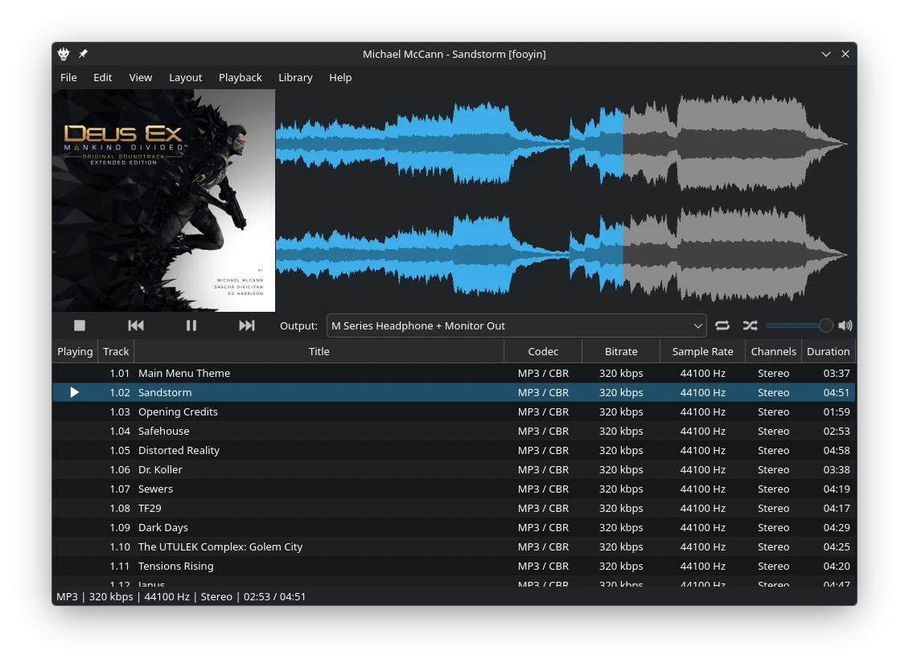

fooyin Documentation
====================

fooyin is a customisable music player for managing and playing a local music collection.
Its interface is built from configurable widgets, while playlists, library tools, metadata editing,
audio processing, and scripting provide control over how a collection is organised and played.

New to fooyin? Start with the :doc:`Quick Start <quick-start/quick-start>`.
It covers the first launch, adding a music library, playing tracks, creating a playlist,
and making an initial layout change.

.. note::

   This project is under active development.

.. toctree::
   :hidden:
   :maxdepth: 1
   :caption: Getting Started

   quick-start/quick-start
   quick-start/adding-files
   quick-start/interface
   quick-start/understanding-layouts
   quick-start/layout-editing-mode
   quick-start/managing-layouts
   quick-start/importing-exporting-layouts

.. toctree::
   :hidden:
   :maxdepth: 1
   :caption: Library

   library/managing-library
   library/browsing-library
   library/searching-library

.. toctree::
   :hidden:
   :maxdepth: 1
   :caption: Playlists

   playlists/working-with-playlists
   playlists/autoplaylists
   playlists/playback-queue

.. toctree::
   :hidden:
   :maxdepth: 1
   :caption: Scripting

   scripting/basics
   scripting/variables
   scripting/functions
   scripting/regular-expressions
   scripting/formatting
