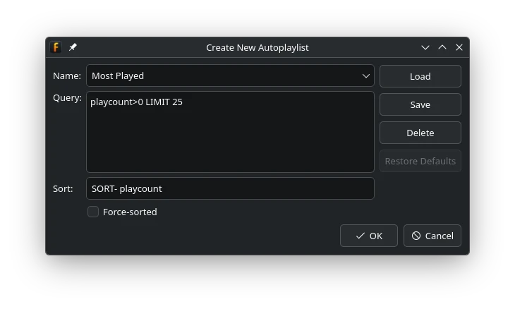

Autoplaylists
=============

An autoplaylist is populated from a library query. Its contents update as the library and query change,
making it useful for lists such as recently added music, unrated tracks, or favourite albums.

Creating an Autoplaylist
------------------------

Choose ``File -> New autoplaylist`` or use the corresponding action in Playlist
Tabs, Playlist Manager, or Playlist Organiser. Enter:

* **Name**, which identifies both the autoplaylist and an optionally saved query preset.
* **Query**, which chooses the matching library tracks.
* **Sort**, which orders matching tracks.
* **Force-sorted**, which controls whether the complete list is reordered when it regenerates.

Both the name and query are required. See :doc:`../library/searching-library` for query
operators, dates, sorting, and limits.

Query and Sort
--------------

Keep filtering in **Query** and ordering in **Sort** when possible. For example, a most-played list could use::

   Query: playcount > 0 LIMIT 25
   Sort:  SORT- playcount

The limit is applied using the chosen order, retaining the 25 tracks with the highest play count.

Force-sorted or Stable Order
----------------------------

With **Force-sorted** enabled, the entire autoplaylist is reordered from the sort expression whenever it regenerates.

With it disabled, existing tracks keep their current order. Newly matching tracks are sorted and appended.
This is useful when you want to make manual ordering decisions without losing automatic membership updates.

Saving Query Presets
--------------------

The buttons beside the autoplaylist fields manage reusable query definitions:

* **Save** stores the current name, query, sort expression, and Force-sorted setting as a preset.
* **Load** recalls a saved definition.
* **Delete** removes the selected saved definition.
* **Restore Defaults** restores the built-in query presets.

A query preset is a reusable definition; an autoplaylist is the live playlist created from that definition.

Editing an Existing Autoplaylist
--------------------------------

Right-click its playlist tab or select it in Playlist Manager or Playlist Organiser, then choose **Edit autoplaylist**.
Changing the query regenerates the contents. Rename it by changing the **Name** field or using the normal
playlist rename action.

Autoplaylist membership should be changed through its query. If you need to add and remove individual tracks freely,
create a normal playlist instead.
