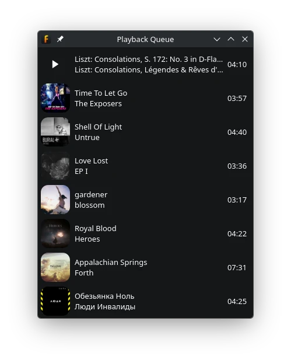

Playback Queue
==============

The playback queue temporarily overrides what fooyin will play next without
changing playlist order. It is useful for choosing a few upcoming tracks while
leaving the underlying playlists intact.

Adding Tracks to the Queue
--------------------------

Select tracks in a playlist or library browser and use one of these context
actions:

* **Add to playback queue** appends the selection to the end of the queue.
* **Queue to play next** inserts the selection at the front of the queue.
* **Remove from playback queue** removes queued occurrences of the selection.

Queued tracks can come from different playlists or directly from the library.
Queue entries are played before fooyin resumes its normal playlist order.

Viewing and Reordering the Queue
--------------------------------

Choose ``View -> Playback Queue`` to open the queue window.
A **Playback Queue** widget can also be inserted into a layout.

In the queue viewer you can:

* Drag entries to reorder them.
* Drop additional tracks into the queue.
* Remove selected entries or clear the entire queue.
* Reverse, randomise, or apply a configured sort preset.
* Double-click an entry to begin playing it.
* Optionally show the currently playing queued track above the remaining
  entries.

The track currently playing from the queue cannot be removed as a pending
entry. Remove or reorder the tracks that remain after it.

What Happens When the Queue Ends?
---------------------------------

The **Queue** group under **Preferences > Playback > General** controls the
transition after the final queued track:

* **Follow last playback queue track** continues with the track following the last queued track in its source playlist.
* **Stop playback after queue finishes** stops after the final queue entry.
* With neither behaviour selected, fooyin returns to its normal playback navigation.

If both continuation and stopping are enabled, stopping takes precedence.

**Clear queue on exit** prevents the queue from being restored the next time fooyin starts.
Leave it disabled when an unfinished queue should survive an application restart.

Queue Versus Playlist
---------------------

Use the queue for a temporary answer to “what should play next?” Use a playlist
when the order should remain available for later editing, saving, or sharing.

Queue operations do not reorder the source playlists. Conversely, moving a
track inside a playlist is not the same as placing it at the front of the
playback queue.

Queue Versus Stop After This
----------------------------

**Stop after this** marks a particular playlist track as the point where
playback should stop. ``Playback -> Stop after current`` stops after whichever
track is playing now. Neither action adds anything to the queue.

Use these commands when playback should end at a chosen boundary; use the queue
when specific tracks should interrupt or extend the upcoming order.
