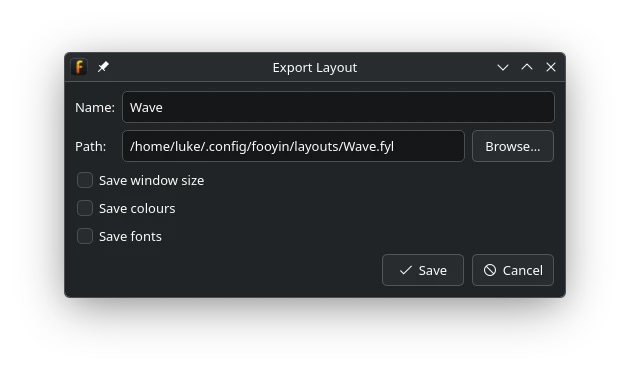
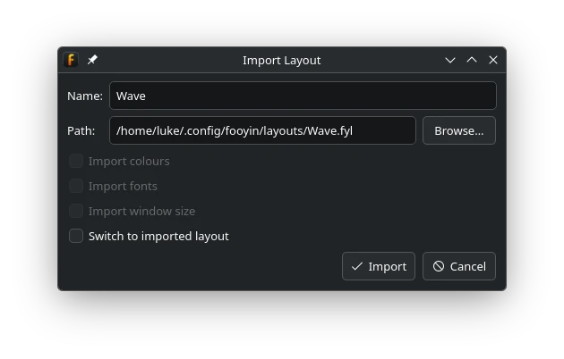

Importing and Exporting Layouts
===============================

fooyin layouts can be saved as ``.fyl`` files for backup or sharing.
A layout file always contains the widget hierarchy and widget configuration.
It may also contain colours, fonts, and a window size.

Exporting Layouts
-----------------

To export the current layout:

1. Choose ``Layout -> Export layout``.
2. Enter the name stored inside the layout.
3. Enter an absolute destination path or use **Browse**.
4. Choose which optional appearance settings to include.
5. Select **Save**.

The optional settings are:

* **Save window size** records the current main-window dimensions.
* **Save colours** includes the colours from the current theme.
* **Save fonts** includes the fonts from the current theme.

Colours and fonts can make a shared layout look consistent on another system,
but they can also override that user's preferred appearance.
Leave them unchecked when the layout only depends on widget placement.

Exporting does not create another layout in fooyin's layout list. It writes a snapshot of the current layout to a file.

Importing Layouts
-----------------

To import a ``.fyl`` file:

1. Choose ``Layout -> Import layout`` and select the file.
2. Review the proposed layout name. If that name already exists, fooyin proposes a unique name; you can edit it again.
3. Choose which embedded appearance settings to import.
4. Optionally enable **Switch to imported layout**.
5. Select **Import**.

**Import colours**, **Import fonts**, and **Import window size** are only available when the file contains those settings.
Colours and fonts are selected by default when present; window size is not.

If **Switch to imported layout** is disabled, the layout is added to the ``Layout`` menu without changing the current interface.

Layout Names and Files
----------------------

The name stored inside a layout and the ``.fyl`` filename are related but separate.
The stored name is what appears in fooyin. Renaming the file later does not rename an already imported layout.

fooyin will not import a layout under a name that is already in use.
Choose a different name in the import dialog instead of overwriting the existing layout.

Compatibility
-------------

After importing, review the layout before removing your existing one.
Layouts that use optional or third-party widgets require those widgets to be installed on the destination system.

Keep exported copies of layouts that required significant work.
They provide a portable backup independently of fooyin's own configuration directory.

See :doc:`managing-layouts` for renaming, duplicating, deleting, and configuring layouts already installed in fooyin.
