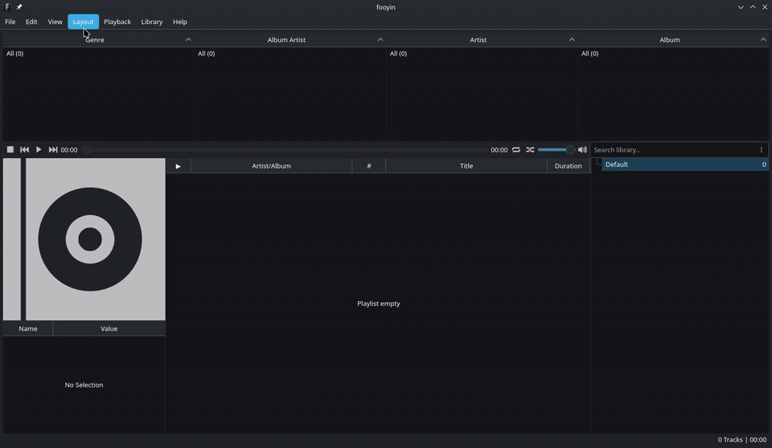
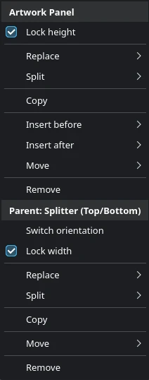
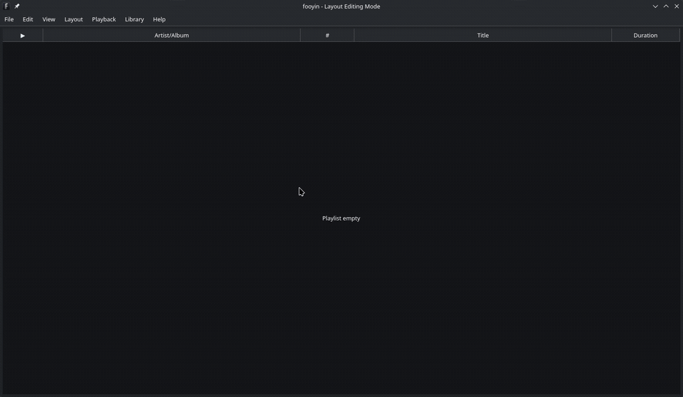

Layout Editing Mode
===================

In **Layout Editing Mode**, right-click menus edit the layout instead of performing the normal actions of a widget.
You can replace, split, insert, move, copy, and remove widgets.

Read :doc:`understanding-layouts` first if you are unfamiliar with widgets, splitters, and parent containers.

Before You Begin
----------------

For extensive changes, duplicate the current layout or export it first.
See :doc:`managing-layouts` and :doc:`importing-exporting-layouts`.

Choose ``Layout -> Editing mode`` to begin. fooyin adds **Layout Editing Mode** to the window title and status area.
Do the same again when finished. Leaving editing mode saves the current layout and restores the normal widget context menus.

Understanding the Editing Menu
------------------------------

Right-click a widget to open its editing menu. The first heading names the selected widget.
Further sections can be labelled ``Parent: ...`` and expose actions for the containers surrounding it.

For example, right-clicking a playlist inside a left/right splitter may show a
**Playlist** section followed by **Parent: Splitter (Left/Right)**.
**Remove** under the first heading removes the playlist;
**Remove** under the second heading removes the entire splitter and its contents.

.. warning::

   Check the nearest section heading before removing or replacing an item.
   Use ``Edit -> Undo`` if an action affects more of the layout than intended.

Replace a Widget
----------------

Use **Replace** when the existing area is the right position but should provide a different feature:

1. Right-click the widget.
2. Under the widget's own heading, open **Replace**.
3. Select the replacement widget.

The old widget and its configuration are removed. The replacement occupies the same position in the parent container.

Split an Area
-------------

Splitting keeps the selected widget and adds another widget beside it:

1. Right-click the widget that should share its area.
2. Under that widget's heading, open **Split**.
3. Choose **Splitter (Left/Right)** or **Splitter (Top/Bottom)**.
4. Right-click the new empty area, open **Insert**, and choose the widget to place there.

The selected widget and an empty placeholder are wrapped in the new splitter.
Drag the splitter handle to adjust the amount of space assigned to each child.

Use **Remove split** when a splitter contains only one real widget and is no longer needed.
This removes the redundant container without removing the remaining widget.

Insert a Widget
---------------

**Insert before** and **Insert after** add a sibling to a container that can hold multiple children.
The direction depends on the container:

* In a left/right splitter, before and after mean left and right.
* In a top/bottom splitter, before and after mean above and below.
* In a tab container, they determine tab order.

**Insert inside** adds a child to the selected container. It is only shown for containers that can accept another child.

An empty placeholder has a single **Insert** menu. Use it to fill the empty area with a widget or container.

Move Widgets
------------

Use **Move** to reorder an item within its current parent.
Depending on the container, the available commands are **Left/Right**, **Up/Down**, **Far Left/Far Right**, or **Top/Bottom**.

To move content between different parts of a layout, use **Copy** followed by **Paste**, then remove the original.
Paste can:

* **Replace** the selected item.
* Insert **Before** or **After** it.
* Insert **Inside** a compatible container.

Copied widget data includes the widget's saved configuration.
Paste options that are not valid at the selected location are omitted.

Remove Widgets and Containers
-----------------------------

Choose **Remove** in the selected widget's section to remove that widget.
If the parent allows another child to be inserted, an empty placeholder may be left behind.

Choosing **Remove** from a parent section removes that container and everything inside it.
This is useful when deliberately simplifying a branch, but it also has a larger effect.

Undo and Redo
-------------

Layout edits can be undone with ``Edit -> Undo`` or ``Ctrl + Z``.
Use ``Edit -> Redo`` or your platform's standard redo shortcut to reapply an edit.

Splitter Sizes and Locks
------------------------

Drag a splitter handle to resize adjacent children.
A child of a splitter may also offer **Lock width** or **Lock height** in its editing menu.
This preserves that dimension during automatic window resizing; the splitter handle can still resize it manually.

``Layout -> Lock splitters`` has a different purpose:
it prevents manual splitter resizing while Layout Editing Mode is disabled.
Enable it after finishing a layout if splitter handles are easy to move accidentally.

For exact margins, spacing, and dimension locks, use the tree-based editor described in :doc:`managing-layouts`.

Starting from an Empty Layout
-----------------------------

``Layout -> Clear layout`` replaces the current contents with an empty placeholder and enters Layout Editing Mode.
Right-click the placeholder and use **Insert** to add the first widget or container.

A practical approach is to insert a top-level splitter first, add the major regions,
and only then split those regions into smaller areas.
