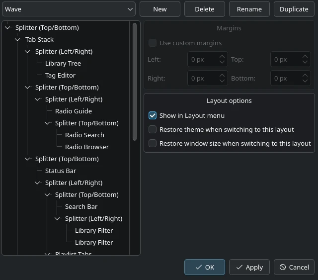

Managing Layouts
================

fooyin provides quick layout actions in the ``Layout`` menu and a detailed
manager under **Preferences > Interface > Layout > Layout**.

The Layout Menu
---------------

The lower part of the ``Layout`` menu lists every available layout. Select a name to switch immediately.
The current layout is marked with a check.

The same menu provides these management actions:

* **New layout** creates and switches to a new layout.
* **Clear layout** removes the current widget tree and enters Layout Editing Mode so you can rebuild it.
* **Reset layout** restores a modified built-in layout to its original state.
  It is only available when the current built-in layout differs from its original definition.
* **Import layout** and **Export layout** work with ``.fyl`` files.

.. warning::

   Clearing or resetting changes the current layout. Duplicate or export a
   layout first if you may want to return to the existing version.

Duplicating and Renaming
------------------------

Open **Preferences > Interface > Layout > Layout** for the full layout manager.
Select a layout from the list at the top, then use the adjacent buttons to create,
delete or reset, rename, or duplicate it.

Duplicating is the safest starting point for extensive edits:

1. Select the layout that is closest to the arrangement you want.
2. Choose **Duplicate** and give the copy a descriptive name.
3. Apply the change to switch to the copy.
4. Close Preferences and enter Layout Editing Mode.

Built-in layouts are reset to their original definition instead of being permanently deleted.
User-created and imported layouts can be deleted after a confirmation prompt.

Editing the Layout Tree
-----------------------

The tree on the left represents the same widget hierarchy that appears in the main window.

Right-click a tree item to access the operations valid for it:

* **Move up** and **Move down** reorder an item within its parent.
* **Remove** removes the selected item.
* **Cut** removes an item and places its data on the layout clipboard.
* **Copy** places an item's data on the layout clipboard without removing it.
* **Paste** inserts the copied item after a compatible selection.

Unavailable operations are hidden. Changes are kept as drafts until you select **Apply** or **OK** in Preferences.

Margins
-------

Select a widget or container and enable **Use custom margins** to set its left,
top, right, and bottom margins in pixels. Disable the option to inherit the normal margins.

Use margins to add space around the outside of an item.
For space between the children of a splitter, use splitter spacing instead.

Splitter Spacing and Dimension Locks
------------------------------------

Select a splitter in the tree to configure **Use custom spacing**.
The spacing value controls the gap between its children.

Select a child of a splitter to configure **Lock width** or **Lock height**.
The available dimension follows the split direction. A locked dimension is preserved during automatic resizing,
although the splitter handle can still change it manually.

This per-child setting is different from ``Layout -> Lock splitters``, which
prevents users from dragging splitter handles outside Layout Editing Mode.

Layout Options
--------------

Each layout can optionally restore additional application state when selected:

* **Restore theme when switching to this layout** associates the layout with its saved theme settings.
* **Restore window size when switching to this layout** associates it with a saved main-window size.

Leave these disabled when switching layouts should only rearrange widgets.
Enable them when a layout was designed for a particular theme or window size.
