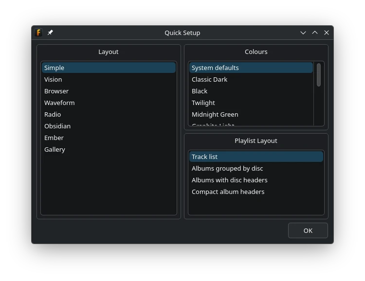
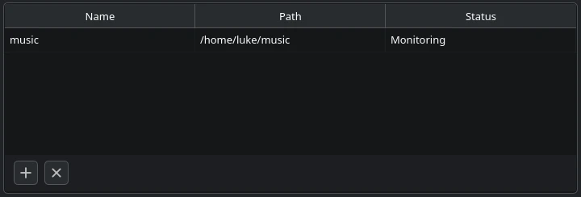

Quick Start
===========

This guide takes you from the first launch to playing music.
It also introduces the layout system without requiring you to build a layout from scratch.

Choose an Initial Appearance
----------------------------

On the first launch, fooyin opens **Quick Setup**. Choose an option in each section:

* **Layout** changes the layout of the main window.
* **Colours** selects a colour scheme. Choose **System defaults** to follow the appearance of your desktop.
* **Playlist Layout** changes how tracks are presented in playlist widgets.

Your choices are previewed immediately. Select **OK** when you are happy with the result.

You can return to this dialog at any time with ``View -> Quick setup``.
Choosing a preset here does not prevent you from changing it or customising it later.

Add Your Music Library
----------------------

A library gives fooyin a persistent, searchable index of your music and can be monitored for changes.

1. Open ``Library -> Configure``.
2. On the **Library > General** page, add a row to the library table.
3. Select the folder containing your music. The folder name is used as the
   initial library name and can be edited in the table.
4. Select **OK** or **Apply**.

fooyin scans the folder and reads the metadata from supported audio files. Scan progress appears in the main window.
You can continue using fooyin while a scan is running.

See :doc:`adding-files` for library monitoring, rescanning, and ways to add files without creating a library.

Browse and Play
---------------

Use a library widget, such as **Library Tree**, to browse the indexed music.
The exact widgets and arrangement depend on the layout chosen in Quick Setup.

In most library widgets, you can right-click a selection to send tracks, albums,
or other groups to a playlist from where they can be played.
The player controls, seek bar, and volume control operate on the current track.

If you cannot find a particular control, see :doc:`interface` for the roles of the most common widgets.

Create a Playlist
-----------------

Choose ``File -> New playlist`` to create an empty playlist. Add music by dragging it from a library widget,
or use ``File -> Add files`` and ``File -> Add folders`` to add music from disk to the current playlist.
Files or folders can also be dragged and dropped onto a playlist from outside fooyin.

These File menu commands do not add folders to the indexed library.
Use ``Library -> Configure`` when you want fooyin to manage and monitor a music folder.

Customise the Layout
--------------------

Once you are comfortable with the basic interface, you can change individual widgets or build a different layout:

1. Read :doc:`understanding-layouts` for the layout model.
2. Follow :doc:`layout-editing-mode` to make your first edit.
3. Use :doc:`managing-layouts` to duplicate or preserve layouts.

It is a good idea to duplicate a layout before making extensive changes.
You can also export it to a ``.fyl`` file as a backup.

Next Steps
----------

* Learn how to maintain a collection in
  :doc:`../library/managing-library`.
* Organise listening sessions with
  :doc:`../playlists/working-with-playlists` and
  :doc:`../playlists/playback-queue`.
* Learn the query language in :doc:`../searching/basics`.
* Use :doc:`../scripting/basics` to customise text shown by compatible widgets.
* Learn how to share and back up layouts in
  :doc:`importing-exporting-layouts`.
